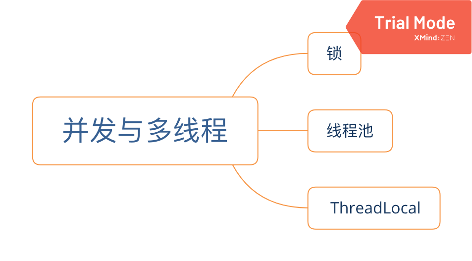

# Easy Coding

### Tools
- javap -c -v X.class
- jar -cvf easycoding.jar easycoding (jar -cvf <Jar_Name> <Dir_Name>)
- sudo apachectl start (/Library/WebServer/Documents/)
- [Hex Friend](https://ridiculousfish.com/hexfiend/)

### 第一章 [计算机基础](./notes/ch01.md)

---

### 第二章 [面向对象](./notes/ch02.md)

---

### 第四章 [JVM](./notes/ch04.md)

------

### 第五章 [异常和日志](./notes/ch05.md)

### 第六章 [数据结构与集合](./notes/ch06.md)

### 第七章 [并发与多线程](./notes/ch07.md)

