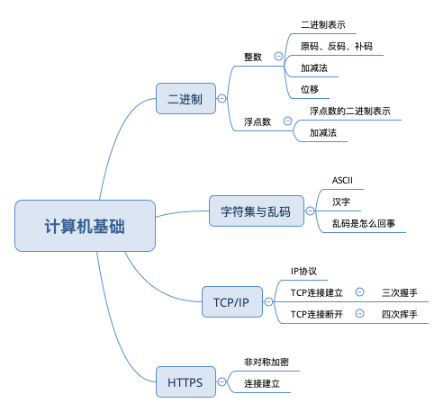

## 第一章 计算机基础



----

### 1. 二进制
整数

* 二进制表示 <br />
  二进制即逢二进一，在电路板中用高低电平来表示0，1 <br />
  1条电路只能表示两种状态：0 或 1，故1条电路最多只能表示2个数字，范围是十进制的0..1 <br/>
  2条电路可以表示4 (2的2次方) 种状态：00, 01, 10, 11. 故2条电路最多可以表示4个数字，范围是十进制的0..3 (0 到 2^2-1) <br />
  8条电路可以表示256 (2的8次方) 种状态，故8条电路最多可以表示256个数字，范围是十进制的0..255 (0 到 2^8-1) <br />
  8条电路在计算机中表示8 bits. 8 bits = 1 Byte<br />
  Java中byte 类型变量占1个字节 (1 Byte = 8 bits), 表示的范围是从 -128..127 <br />
  
  *Q1： 刚才说到8条电路就是8 bits，他的范围是0..255，那byte也是8 bits，为什么他的范围不是 0..255，反而是-128..127？* <br />
  A1: 
  - 因为负数本身是一个很常见的情况，那对于8条电路来说，怎么表示负数呢？
  - 8条电路, 我们规定最左侧的一条表示正负，0表示正数，1表示负数。这条电路不参与数值表示。
  - 那么8条电路的最大值就是： 0-1111111 (1个0表示正数，7个1表示数值)。7个1所代表的最大数值是 +127
  - 那么8条电路的最小值就是： 1-1111111 (1个1表示负数，7个1表示数值)。7个1所代表的最小数值是 -127
  - 你可能会问，这个范围不是 -127..127 吗？-128怎么来的？
  - 在Java中，数字都是以补码的形式存储的。正数的补码和他的原码、反码是一样的；负数的补码等于他的反码+1；
  - 127的原码反码补码为 0111-1111.
  - -128补码的计算方式为，取出128的原码1000-0000，逐位取反得到0111-1111，加1之后又变为了 1000-0000
  - 因为所有的数字都是以补码形式存在，那么当计算机看到1000-0000的时候，他就是指-128, 而不是128.
  - 128的二进制是1000-0000，这个是不能用8 bits来表示的，因为他跟-128会发生歧义。
  - [这里有具体的解释](https://stackoverflow.com/questions/3621067/why-is-the-range-of-bytes-128-to-127-in-java)
  
  
* 原码 反码 补码 <br />
正数的补码和他的原码、反码是一样的；负数的补码等于他的反码+1；<br />
举例来说：35的原码、反码、补码是：0010-0011 <br/>
-35<br />
原码是：1010-0011<br />
反码是：1101-1100<br />
补码是：1101-1101<br />

-35的补码的另外一个解法：求得35的原码，逐位取反，然后加1，得到跟上面的结果是一样的。

* 加减运算

计算机内部用补码存储的一个好处就是，减法也可以用补码的加法来实现。比如

```
  00100011 --> 35
+ 11011011 --> -37 (补码)
----------
  11111110 --> -2 (补码)
```

* 位移运算

带符号位移 << >> <br />
带符号位移表示符号位参与移动。这种情况下，只有负数右移的情况高位补1，其他情况（包括正数左移、右移；负数的左移）都是空位补0 <br />
负数右移：因为负数的最高位是符号位，用1表示负数。当右移之后，应该保持符号位不变。<br />
右移: -35 右移1位: 1101-1101 >> 1 = 1110-1110 (补码), 再取补码得到: 1001-0010 = -18 (近似除以2) <br />
正数右移: 35. 0010-0011 >> 1 = 0001-0001 = 17 (近似除以2) <br />

其他情况比如: 负数左移, -35 << 1 = -70. 他的计算过程如下:
-35 的补码是: 1101-1101 左移一位, 空位补0, 结果为: 1011-1010, 注意此处的结果为补码. 想得到他所表示的数字需要取反再加1(补码的补码等于原码)
1011-1010 取反 = 1100-0101 加1 = 1100-0110 = -70. <br />

正数左移: 35左移1位: 0010-0011 << 1 = 0100-0110 = 70. <br />
总体来说在不溢出的情况下,左移1位相当于乘以2; 右移1位近似除以2<br />
正数左移的结果可能是正数也可能是负数; 负数左移的结果可能是负数也可能是正数.<br />

比如byte 类型的 64左移一位: 0100-0000 << 1 = 1000-0000 = -128 (正数左移得到负数)<br/>
-96左移一位: 1010-0000 << 1 = 0100-0000 = 64 (负数左移得到正数)


无符号位移 >>> <br />
注意不存在 <<< 无符号左移. <br />
在无符号右移的情况下,符号位和正常的数字一样,一起参与移动. 无论是正数还是负数.高位直接补0. <br />
对于int(32位)来说,右移1位的结果等于右移33位的结果.也就是说右移的实际位数是 n%32. <br/>
同理,对于 long(64位) 来说, 右移1位等于右移65位,右移5位等于右移69位. 也就是说实际位数是 n%64 <br />


### 2. 浮点数

浮点数在计算机中的表示方法类似于数学中的科学计数法.
科学计数法的表示是 a x 10^n (aen). 也就是一个常数 乘以 10的 n 次方.

以32位浮点数为例,他在计算机中的表示方法如下:
32位即32bit

第一个 bit 表示符号位 <br />
紧接着后面 8 bit 表示指数(也就是 n 次方的 n) <br />
还剩下23 bit, 用来表示有效数字(也就是 科学计数法 中的 a) <br />

符号位, 1 为负数; 0 为正数.

8 bit的指数又叫做阶码. 他所能代表的范围不是 0..256(2^8), 而是 -126..127

其中23 bit 的有效数字可以全部为0, 这种情况代表有效数字为 1.0<br/>
1这个数字是默认存在的,这样的话用23bit 可以达到24个 bit 的效果.<br/>
也就是说如果23bit 全部为1的情况下等于二进制的1.111...11 (小数点后共23个1), 这是一个无限接近于2的值.<br/>

所以32bit 的浮点数,最大可以表示: 2*2^127. 2^127 ~= 1.7 X 10^38. 所以最大值即: 2 x 1.7 x 10^38.

* 浮点数表示实例:
-16 = 1/1000-0011/000..000(23个0)

```
1 - 代表负数

阶码: 1000-0011 - 这个二进制的10进制数值是131. 131 - 127 = 4. 也就是 2的4次方.

有效数字: 尾数部分等于0.

也就是1.0 x 2^4 = 16.
```

解释一下为什么`阶码`是131. 而不直接是4. <br/>
简单来说,当需要表示小数的时候需要用到2的负数次方. 所以`阶码`不能从0开始,而是从-126开始的.
127只是一个中点值. 任何数值的指数部分的值都要减去127得到真正的指数值,然后再求出2的指数次方.
这样的话2的-1次方就可以得到一个0.5的值.当用1.0*0.5的时候就得到了一个浮点数.

详细一点来说的话就是,阶码的表示方法实际上是用移码表示的. 
所谓移码就是把一个数值映射到正数域,其特点是可以直观的反映两个真值的大小,对计算机来说不用考虑负号的问题.

[TBD] 此处需要解释的更详细.


* 加减运算

	- 零值检测
	- 对阶操作
	- 尾数求和
	- 结果规格化
	- 结果舍入
[TBD] 需要加一个实例来解释对每个步骤的说明

### 3. 字符集与乱码

* ASCII
	
	起初计算机为用0-1信号表示不同的字符,先考虑到的是英文的26个字符大写和小写加上0-9这10个数字,这样就至少有62个字符,除此之外还有一些特殊字符,比如~!@#这样的,加起来一定是超过了64个(我想键盘上的英文字母加数字加上特殊字符一共也不会超过127个). 这里提到了超过64是因为64这个数字是2的6次方.6次方即为6bit. 如果超过了6bit 所能表示的范围,那么至少是需要7个 bit 来表示这些字符的.<br/>
	再加上一个奇偶校验位,所以最后决定用8bit 来表示一个字符.这就是1Byte = 8bit 的由来.也就是 ASCII.
	
	
* 汉字
	
	当计算机在中国设计的时候肯定需要用到汉字.而汉字的数量众多,用1Byte (8个 bit 才能表示127个字符)肯定是不够的,那么肯定得扩展.所以就在 ASCII 的基础上进行扩展,保持对 ASCII 的兼容.<br/>
	一个字节只能表示128个字符,所以汉字需要采用双字节进行编码(双字节就是2Byte,他可以表示65535个字符,现在汉字数量是91251个,很明显不够对吧?这是在GB2312中收录了 6763 个常用汉字, GBK (k == kuo 是扩展的意思) 在GB2312基础上进行了扩展,支持繁体字).<br/>
	ASCII 码其实就是一种字符编码约定.比如约定 ASCII=65 就是表示A. 97就是表示 a,这是规定好的.这个也就是我们常常会去查阅的 ASCII 码表. <br/>
	类似的汉字的编码表在保留了前128个 ASCII 之外增加了其他的数字与汉字的映射关系.也就是说无论是GBK \ GB2312 还是 Unicode \ UTF-8 \ UTF-16 分别规定了自己的码表,确定了该编码方式能表示的字符(不仅仅是汉字还有其他非英文国家的字符). 
	
* 乱码是怎么回事

	当我们保存文字到记事本或者数据库的时候(其实都是保存到了磁盘),都需要为记事本或者数据库指定一个编码方式,当以指定的编码方式保存之后就要用与这个编码方式兼容的编码来读取;否则就会出现乱码.<br/>
	举个例子来说, 假设 22909 用 Unicode 编码是 '好' 这个字, 并且存到了记事本中, 如果我们用非 Unicode 编码来读取这个文件,恰好这个编码方式与 Unicode 不兼容的话,显示出来的就是乱码.
	
	
### 3. TCP/IP


### 4. HTTPS
	
