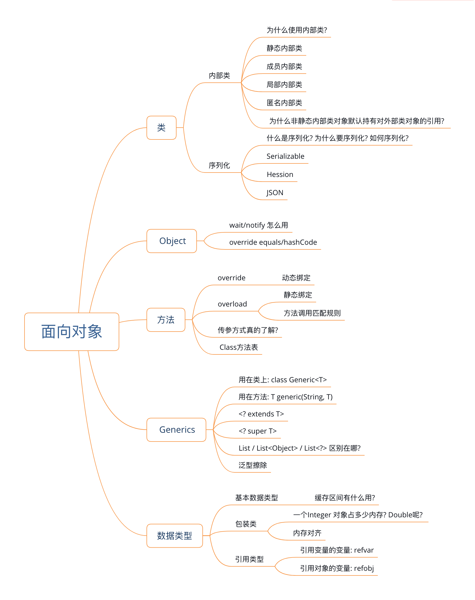

## 第二章 面向对象




## Class

* 4种内部类

  * 使用内部类的3 个原因 [Nested Class](https://docs.oracle.com/javase/tutorial/java/javaOO/nested.html)
    1. 内部类可以让具有相关逻辑的代码放到同一个类中: 如果某个类只被另外一个类用到,那么这个类可以被定义为另外一个类的内部类.其他类不会关心到这个类的存在.
    2. 内部类可以增强内聚: (跟 1 类似) 如果有 A-B 两个类, 因为 A类里面某个成员变量需要被 B类访问到, 则 A类的成员变量不能被定义为 private; 如果把 B类定义为 A 类的一个内部类,则 A类的成员变量可以直接被定义为 private . 这些成员变量就不会被其他类访问到.
    3. 内部类有更好的可读性和可维护性. 被定义为内部类在读代码的时候距离被用到的地方更近.
  * 内部类的分类: 按照定义方式分为 4 类. 静态内部类 / 成员内部类 / 局部内部类 / 匿名内部类.
  * 其中: 除了静态内部类之外, 其他 3 种内部类都默认持有对外部类对象的引用. 
  * 内部类共同的特点: 编译之后的类名中都会带有 '\$'. 局部内部类和匿名内部类还会带有数字.
    * 其中, 静态内部类和成员内部类的命名方式为: outer_class_name\$inner_class_name.class
    * 局部内部类的命名方式为: outer_class_name\${1}inner_class_name.class
    * 匿名内部类的命名方式为: outer_class_name${1}.class — 因为匿名内部类没有名称所以只有数字

  1. 静态内部类

     定义方式: 定义在外部类中. [private] static class StaticInnerClass { .. }

     用法特点:  

     ​	可以访问外部类的私有静态字段和私有静态方法. 通过 `OuterClass.StaticInnerClass()` 访问.

     ​	不可以直接访问外部类的成员变量

     ```java
     // Outer class 中访问 StaticInnerClass
     StaticInnerClass staticInnerClass = new StaticInnerClass();
     // 其他类中访问 StaticInnerClass, StaticInnerClass 必须不是 private 才能在其他类中访问
     OuterClass.StaticInnerClass staticInnerClass = new OuterClass.StaticInnerClass();
     ```

  

  

  2. 成员内部类

     定义方式: 定义在外部类中. [private] class InstanceInnerClass { .. }

     用法特点: 可以直接访问外部类的私有成员变量. 通过 `outerClassObject.new InstanceInnerClass()` 访问.

     **在成员内部类中不能定义 static 类型的变量, 但可以定义 static final 类型的常量**

     ```java
     OuterClass outerClass = new OuterClass();
     InstanceInnerClass innerClassObj = new outerClass.new InstanceInnerClass();
     ```

  

  ​		- 当在成员内部类中访问外部类的方法(比如 foo 方法)时, 可以直接调用 foo(); 也可以 `OuterClass.this.foo()`. 他们之间的区别在于后者明确调用的是外部类的 foo 方法. 如果内部类中没有定义 foo 方法,则两个没有区别; 如果内部类中也有 foo 方法,则会调用内部类的 foo 方法.

  

  Mini-Summary:

  | 内部类类型 | 访问外部类静态常量 | 访问外部类静态变量 | 访问外部类成员变量                 |
  | ---------- | ------------------ | ------------------ | ---------------------------------- |
  | 静态内部类 | Yes                | Yes                | No (需要 new 外部类的实例然后访问) |
  | 成员内部类 | Yes                | Yes                | Yes                                |

  

  3. 局部内部类

     定义方式: 定义在方法内部. class MethodClass { .. }

     用法特点: 跟成员内部类一样, 可以直接访问外部类的成员变量

     **不能在方法块中定义 interface. **

     **不能在局部内部类中定义静态的变量或方法, 但可以定义 static final 的常量 **

     **不能在局部内部类中访问方法块中的变量, 但可以访问 final 常量**

     

  4. 匿名内部类

     定义方式: 定义在方法内部. (new Thread() {}).start();

     用法特点: 让代码变的简洁. 用法和局部内部类一样除了他没有类名. 如果这个类仅仅会被用到一次, 就可以使用匿名内部类.

     常见于定义按钮的回调.

     ```Java
     label.setOnClickListener(new OnClickListener() {
         @Override
         public void onClick(View v) {
            // Handle OnClick event here             
         }
     });
     ```

     因为回调这种事件需要处理的频率非常高,如果不用匿名内部类的话我们需要为每个按钮都定义一个类,这样代码冗余太严重.

     

     | 内部类类型 | 访问外部类所有类型字段 | 访问局部常量                                                 | 访问局部变量 |
     | ---------- | ---------------------- | ------------------------------------------------------------ | ------------ |
     | 局部内部类 | Yes                    | Yes <br /> (从 1.8 开始, 还允许访问 effective final 类型的变量) | No           |
     | 匿名内部类 | Yes                    | Yes                                                          | No           |

     有人说匿名内部类有点 closure 的意思.我目前还没感受到他们之间有什么明确的相似性.

     [JavaScript closures](<https://stackoverflow.com/questions/111102/how-do-javascript-closures-work>)

* 序列化
  1. Serializable
  2. Hession
  3. JSON

## Object


## Method


## Generics


## DataTypes


(TBC-1) Synthetic constructs in Java

-1-