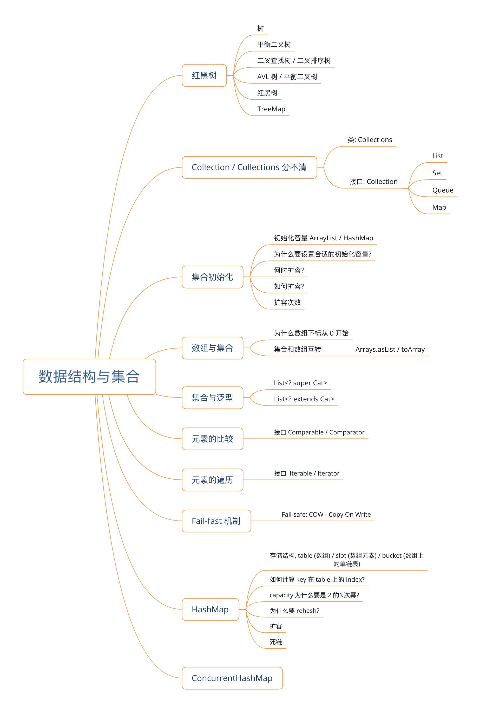

### 第六章 数据结构与集合

----




#### Collection / Collections

-------

Collection 是接口: java.util.Collection. 常见的子接口有: List / Set / Map / Queue 等

- Collections 是类: 在这个类中提供了很多常见的作用于 Collection 上的操作. 比如 sort / reverse.
- Collection 的子接口的实现类:
  - ArrayList
  - HashSet
  - ArrayDeque (双向链表) / ArrayBlockingQueue (阻塞队列 - 第七章再看)
  - HashMap

####  集合初始化

-----

##### 1. 初始化容量

- ArrayList的初始化容量默认是 10 `new ArrayList()` 不指定 size 的情况下默认容量为 10
- HashMap 的初始化容量默认是 16. 负载因子默认是 0.75 `new HashMap()` 不指定 size 的情况下默认容量是 16, 负载因子是 0.75. 当元素个数大于等于 16*0.75 = 12 的时候开始扩容

##### 2. 为什么要设置合适的初始化容量

- 扩容: 当集合中元素个数达到一定数量的时候, 集合内部的数据结构不足以容纳更多的数据, 此时必须通过扩容来增加容量来得到更多的存储空间
- 而整个扩容过程是比较耗时的.
- 如果能提前知道集合大致的容量,那么就可以避免扩容或者减少扩容次数

##### 3. 何时扩容

- ArrayList 扩容触发条件: 当元素个数大于当前数组的长度时进行扩容. 比如默认capacity 是 10, 当添加第 11 个元素时进行扩容.
- HashMap 扩容触发条件:  当元素个数大于阈值(threshold)时进行扩容. 

##### 4. 如何扩容

- ArrayList 扩容: 创建一个原数组1.5 倍长度的新数组, 将原数组中的元素复制到新的数组中.

  ```java
  newLength = oldLength + (oldLength >> 1);
  Arrays.copyOf(T[] original, int newLength);
  System.arrayCopy(orignalArray, srcPos, destArray, desPos, length);
  ```

  

- HashMap 扩容: (TODO) 待完善. 每次扩容都是原容量的 2 倍

  ```java
  
  ```

##### 5. 扩容次数

- ArrayList. 不指定size的情况下, 默认为 10, 往 ArrayList 里面加 1000 个元素扩容过程为:

  ```
  10
  15
  22
  33
  49
  73
  109
  163
  244
  366
  549
  823
  1234
  ```

  

- HashMap 不指定 size 的情况下, 默认为 16, 在添加第 13 个元素的时候开始扩容, 添加 1000 个元素扩容过程为:

  ```
  16
  32
  64
  128
  256
  512
  1024
  ```


#### 数组与集合

------

1. 数组下标从 0 开始的原因是, 数组的指针指向的是数组存放内存的起始地址. 数组元素访问是从起始地址开始 加上元素索引✖️每个元素占用内存大小. 从1 开始的话每次计算访问地址都需要减去 1. 从 0 开始省去每次减去 1 的操作.

2. 集合和数组互转.

   1. Arrays.asList(T[] arr). — 传入参数是要转化的原数组. 注意此处返回的 list 对象是一个只读的. 因为返回的对象是 Arrays类的一个内部类. 这个内部类不允许对 list 进行修改.

   2. List.toArray(T[] arr) — 传入的参数是把 list 转化成数组之后存放的数组对象. 此数组的长度应该跟 list 的 size 一致.

      ```java
      
      public class ArrayAndCollectionsDemo {
          public static void main(String[] args) {
              Integer[] integerArray = {1, 2, 3};
              List<Integer> integerList = Arrays.asList(integerArray);
              // 编译通过 运行出错.
              // 因为 asList 返回的不是 ArrayList 而是Arrays中的一个内部类
              integerList.add(4);
      
              // List.toArray(T[] arr)
              // 传入一个数组, 这个数组的长度应该跟 list 的 size 一致
              // 此时运行效率是最高的
              // 如果数组的长度小于list 的 size, 则传入的数组对象直接被弃用
              // 然后根据 list 的 size 创建一个新的数组
              Integer[] getFromArray = new Integer[integerList.size()];
              integerList.toArray(getFromArray);
              System.out.println(getFromArray[0]);
          }
      }
      ```

      

#### 集合与泛型

-------

List<? extends Cat>

	1. 用在引用. List<? extends Cat> catsList = getCatsList(); 此时这个对象是只读的. 只能遍历不能 add
 	2. 赋值: 只能赋值给 `List<Cat>` 或 `List<KittyCat>` 不能赋值给`List<Animal>`. 因为 Animal 不 extends Cat
 	3. 用在方法. private void doSomething(List<? extends Cat> catsList). 只可以接收 `List<Cat>` 或者 `List<Cat 的子类> ` 不能接收 `List<Animal>` 因为传入的 Animal extends Cat 不成立.(类似 2)
 	4. 用在方法. `public static <T extends Comparable<? extends T>> doSomething(List<T> t) `. 这个要求传入的 list 中的每个元素都要 extends Comparable (接口和类都是用 extends 关键字). 并且 T类中为 Comparable 提供的泛型参数应该 extends T (即: T的子类, T为上界)

List<? super Cat>

1. 用在引用. List<? super Cat> catsList = new ArrayList<>(); 此时这个对象可读可写. 写入的时候(add 方法)传入的类型应该是 Cat 的子类. 遍历的时候泛型丢失. 只能以 Object 进行遍历
2. 赋值: 只能赋值给 `List<Animal>/ List<Cat>` 不能赋值给 `List<KittyCat>` 因为 KittyCat 不 super Cat
3. 用在方法: public void doSomething(List<? super Cat>) 可以接收`List<Animal> / List<Cat>` 不能接收 `List<KittyCat>`
4. 用在方法. `public static <T extends Comparable<? super T>> sort(List<T> tList)`. List 中的元素都要implements Comparable 接口, 同时T类为 Comparable 提供的泛型类型应该是 super T (即为 T 的父类, T为下界).


#### Comparable / Comparator

----

- Comparable - 自己定义的类 implements 这个接口, 并实现其中的 compareTo(Object o) 方法. 返回 int. 1 / 0 / -1.
- Comparator - 当需要对第三方提供的类进行排序时用这个接口. 
  - 自定义一个类 implements Comparator<第三方 class>. 实现其 `compareTo(Object o1, Object o2)`方法.
  - 返回 1 / 0 / -1

- 对 List 进行升序排序, list 中的元素需要 implements Comparable 接口: 

```java
Collections.sort(List)
  
// 降序排列. Collections.reverseOrder 返回的是一个 comparator  
Collections.sort(list, Collections.reverseOrder())
```


#### Iterable / Iterator

----

(TODO) Head First 设计模式, 迭代器模式


#### Fail-fast

----

- Fail-fast 是什么? fail-fast 意思是某个过程可能会失败, 而且在这个过程中一直去检查,一旦发现异常立即停止. 
- 为什么需要 Fail-fast? fail-fast 机制避免了某些可能发生的灾害性的错误.
- fail-safe: 弱一致性. Weakly-consistent. 
- 支持Fail-fast的集合: ArrayList / HashSet.
- fail-safe 的集合: CopyOnWriteArrayList / CopyOnWriteArraySet
- Fail-safe 的原理: 支持多个线程遍历同一个集合 (多线程读). 当有线程需要修改集合的时候, 会将集合中全部内容 copy 到另外一个新的集合当中, 在新集合当中进行修改, 修改完毕之后将原来的集合指向新集合. 原来的集合同时可以被读取,但在新集合被赋值给原集合之前读线程访问不到最新的修改. (弱一致性).
- [StackOverflow - What are fail-safe & fail-fast Iterators in Java](https://stackoverflow.com/a/17377698/853191)
- [StackOverflow - Why we need fail fast and fail safe software design?](https://stackoverflow.com/a/45714229/853191)

#### HashMap

----

